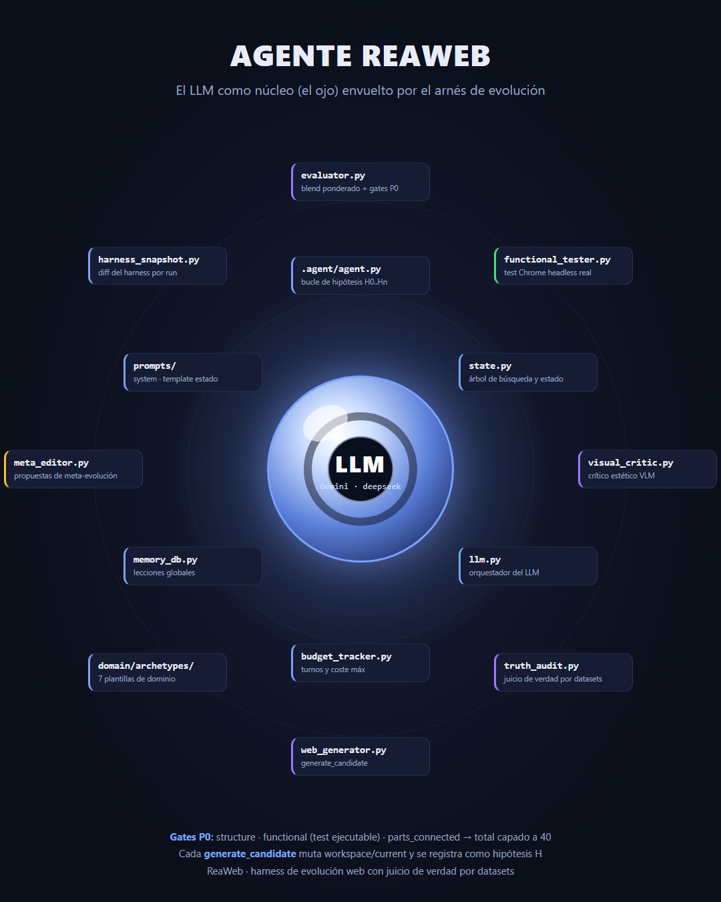
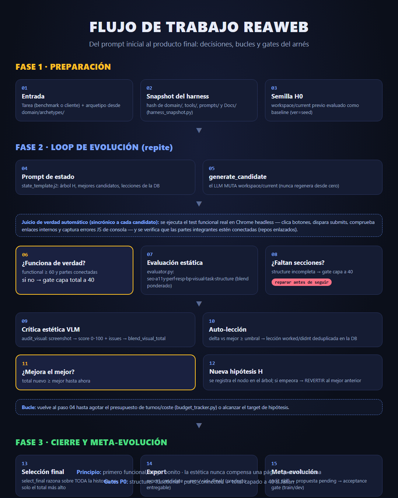

# Tarjetas didácticas de ReaWeb

Documentación visual del harness de evolución web. Las tarjetas se renderizan
desde fuentes HTML/CSS (editables en `cardN_src.html`) y se exportan a PNG con
Chrome headless:

```bash
# regenerar ambas tarjetas a PNG
python -m scripts.gen_cards          # (los .src.html se generan y renderizan)
```

## 1. Agente ReaWeb — el LLM y su arnés



La esfera central (el ojo) es el **LLM**; a su alrededor, orbitando, cada pieza
del arnés desarrollado para ReaWeb:

- **Núcleo**: `agent.py` (bucle de hipótesis H0..Hn), `state.py` (árbol de
  búsqueda), `llm.py` (orquestador), `budget_tracker.py` (turnos/coste),
  `memory_db.py` (lecciones globales), `prompts/`.
- **Juicio de verdad**: `evaluator.py` (blend ponderado + gates P0),
  `functional_tester.py` (test Chrome headless real), `visual_critic.py`
  (crítico estético VLM), `truth_audit.py` (juicio por datasets).
- **Generación**: `web_generator.py` (generate_candidate), `domain/archetypes/`.
- **Meta-evolución**: `meta_editor.py` (propuestas), `harness_snapshot.py`
  (diff del harness por run).

## 2. Flujo de trabajo end-to-end



Del prompt inicial al producto final, con las **decisiones y bucles** reales del
arnés (no una simple secuencia): el gate funcional que capa candidatos rotos, el
bucle de hipótesis que muta en vez de regenerar, la doble señal (VLM estético +
juicio de verdad por datasets) y la meta-evolución con acceptance gate.

## Regenerar o editar

- Edita `card1_src.html` / `card2_src.html` (HTML/CSS con flujo de texto).
- Regenera el PNG con Chrome headless:
  `chrome --headless=new --window-size=1080,1350 --screenshot=<salida>.png file://<fuente>.html`
