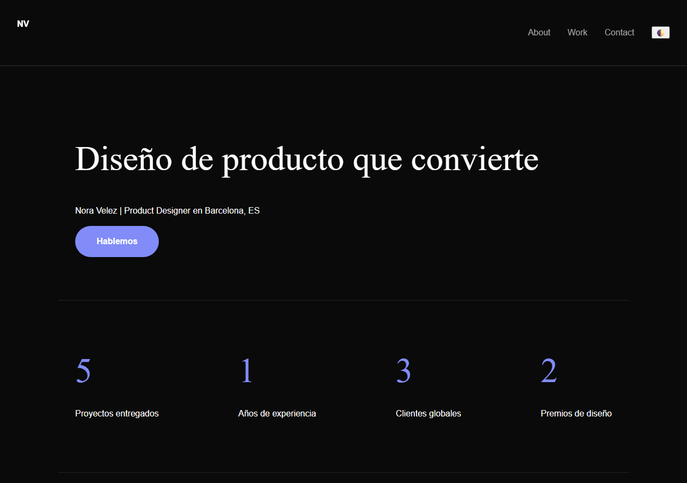
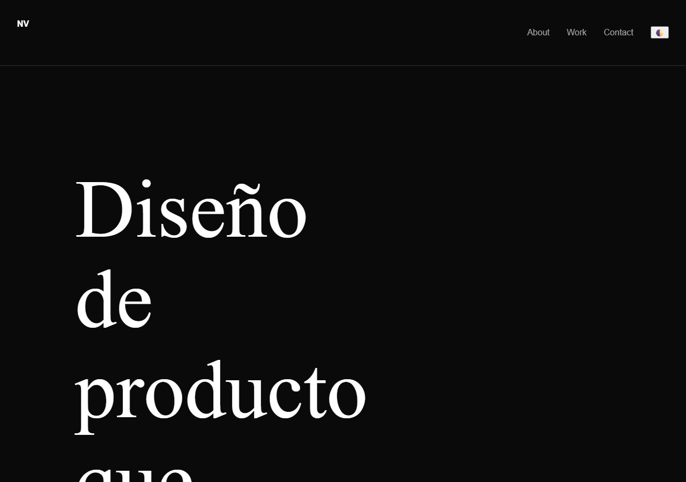

# ReaWeb

[](https://github.com/VicenteVila/ReaWeb/actions/workflows/ci.yml)
[](pyproject.toml)
[](LICENSE)
[](https://github.com/VicenteVila/ReaWeb/releases)
[](https://github.com/astral-sh/uv)

Agente **ReASearch** de optimización web: dado un arquetipo y una tarea, desarrolla
páginas web iterativamente (genera candidato → audita → mejora) y, además,
**evoluciona su propio harness** (reglas, skills y workflows en `domain/`).

Basado en:

- **ReASearch** — Li, J., Liu, B., Xu, C., Wang, Y., He, Y., Wang, Z., Liu, Q.,
  & Yao, Z. (2026). *The Optimizer Is the Agent: Reasoning-Driven Search across
  Prompts, Programs, and ML Workflows*. COLM 2026.
  https://doi.org/10.48550/arXiv.2608.06714 — el agente es el optimizador: sin
  loop externo, re-emisión de estado cada turno, memoria persistente y
  meta-evolución.
- **AutoDesign** — Luo, Y., Jiang, H., Zou, J., Huang, X., Yan, W., Li, H.,
  Yue, Z., Li, J., Chen, X., Zhao, X., Liu, J., Cui, J., Shen, Z., & Li, X.
  (2026). *AutoDesign: Meta-Harness Optimization for Long-Horizon Agentic
  Design*. arXiv:2608.13560.
  https://doi.org/10.48550/arXiv.2608.13560 — meta-harness optimization con
  rollout feedback: el harness se mejora a sí mismo y un **crítico estético VLM**
  (§3.4) guía la siguiente mutación.
- **Practice Makes Unsafe** — Mao, X., Zhao, L., Zheng, X., & Wang, C. (2026).
  *Practice Makes Unsafe: Skill Misevolution in Self-Improving LLM Agents*.
  arXiv:2608.12851. https://doi.org/10.48550/arXiv.2608.12851 — un éxito inseguro
  puede convertirse en política reutilizable (skill misevolution); motivó la capa
  de **gobernanza de skills** (write / retrieval / reuse gates sobre
  `lessons.db`, ver sección *Gobernanza de skills* abajo).
- **Task-CoEvolve** — Miyai, A., Aizawa, K., & Yamasaki, T. (2026). *Task-CoEvolve:
  Efficient Harness Optimization via Adaptive Validation Task Selection*.
  arXiv:2608.20169. https://doi.org/10.48550/arXiv.2608.20169 — selección
  adaptativa de tareas de validación: el pool no se evalúa entero en cada
  pasada, sino un subconjunto muestreado por poder discriminante con estimación
  sampling-aware del score full-suite (`tools/domain/task_coevolve.py`, ver
  [`Docs/TASK_CO_EVOLUTION.md`](Docs/TASK_CO_EVOLUTION.md)).
- **WikiSkill** — Wang, Y. et al. (2026). *WikiSkill: Compiling Agent Experience
  into Persistent Knowledge for Skill Evolution*. Google DeepMind — memoria
  persistente en tres capas (Raw / Wiki / Skill): la capa Wiki la consolida un
  Wiki Maintainer post-run y de la Skill se alimenta el re-ranking de PEARL
  (ver sección *Conocimiento procedural y memoria* abajo).
- **Procedural Graph** — Lu, Y., et al. (2026). *Procedural Graphs:
  Self-Evolving Execution Structures for LLM Agents*. Google Research —
  conocimiento procedural declarativo en triplets dirigidos `(u, r, v)` con
  guidance/pitfalls: el PG Proposer propone cambios estructurales post-run y el
  vecindario del nodo activo se inyecta en el estado del agente (ver sección
  *Conocimiento procedural y memoria* abajo).
- **PEARL** — *Path-Entity Aligned Relational Learning with Contextual Subgraphs
  for Inductive Knowledge Graph Completion* (2026) — su **LPRA** (§3.4) se
  implementa como re-ranking semántico de la Skill Layer
  (`tools/domain/pg_reranker.py`), recortando el pool de skills al `top_k`
  relevante al nodo/fase PG activo (ver sección *Conocimiento procedural y
  memoria* abajo).
- **Propuesta Arquitectura de Agente Web** — diseño de carpetas, stack y estrategia
  free-tier.
- **Docs/** — reglas globales, skills, workflows y documentación de diseño.
- **domain/** — conocimiento vivo: reglas, skills, workflows y **7 arquetipos** de
  web development.

Documentación del diseño (para humanos):

- [`Docs/REASONING.md`](Docs/REASONING.md) — por qué y cómo se construyó el agente
  (decisiones de diseño + historial real de desarrollo).
- [`Docs/READAPTATION.md`](Docs/READAPTATION.md) — adaptación de ReASearch,
  AutoDesign y "Practice Makes Unsafe" al dominio web, con citaciones formales
  (APA + BibTeX) y tablas de mapeo.
- [`Docs/EVOLUTION.md`](Docs/EVOLUTION.md) — cómo el aprendizaje se convierte en
  nuevas reglas del harness, cómo se mide la evolución y cómo se **gobierna el
  riesgo** de esa evolución (§2.11, skill misevolution).
- [`Docs/cards/`](Docs/cards/) — tarjetas didácticas visuales: el agente ReaWeb y
  su arnés (esfera-ojo LLM envuelta por cada módulo) y el flujo de trabajo
  end-to-end con decisiones y bucles.
- [`Docs/TASK_CO_EVOLUTION.md`](Docs/TASK_CO_EVOLUTION.md) — adaptación de
  Task-CoEvolve (selección adaptativa de validación) con citaciones y tablas de
  mapeo.
- [`Docs/GRAPH_ENGINEERING.md`](Docs/GRAPH_ENGINEERING.md) — adaptación de
  Graph Engineering (genealogía de ediciones, causalidad de fallos, grafo de
  dependencias de tools) con citaciones y límites de la adaptación.
- [`Docs/PG_AB_VALIDATION.md`](Docs/PG_AB_VALIDATION.md) — validación
  experimental A/B del **Procedural Graph + PEARL** (PG declarativo, PG
  Proposer, re-ranking LPRA y Skill Layer de WikiSkill) sobre el benchmark
  portfolio: 8 runs, abltest con factor de Bayes.

## Demo visual (Show, don't tell)

Una run real (benchmark portfolio, `20260817T124332`): el agente partió de H0,
exploró variantes y exportó H2 como mejor candidato.

| H0 (baseline, seed) | H2 (mejor candidato exportado) | H5 (variante de exploración) |
|---|---|---|
|  |  |  |

Las imágenes se renderizan con Chrome headless desde los snapshots congelados de
la run (`runs/<ts>--portfolio/candidates/H<i>/`); se regeneran en cualquier
momento con `scripts/render_dashboard.py --run <run_id>`.

## Stack

- Python 3.12, `google-genai` (Gemini), Pydantic, Jinja2, YAML.
- Modelo por defecto: `gemini-3.1-pro-preview` con **fallback automático** a
  `gemini-3.1-flash-lite` → `gemini-3-flash-preview` si la quota free-tier se agota.
- Evaluador ligero (sin Chrome): scores SEO, A11y, Performance, Responsive,
  Best Practices (0-100).

## Empieza en 30 segundos

Con Python 3.10+ y [uv](https://docs.astral.sh/uv/) instalado:

```bash
git clone https://github.com/VicenteVila/ReaWeb
cd ReaWeb
uv sync --extra dev
cp .env.example .env          # pega tu GEMINI_API_KEY
uv run reaweb --quick "landing para un SaaS de analítica de IA"
```

En `--quick` el agente genera el candidato inicial (H0), lo audita, mejora una
vez (H1) y exporta el final con presupuesto mínimo (4 turnos, $0.50, sin
meta-evolución ni críticos VLM). Resultado en `workspace/current/` y copia en
`runs/<fecha>--landing-page/final/`.

¿Quieres la suite completa de investigación (más hipótesis, críticos VLM,
meta-evolución)? Omita `--quick`:

```bash
uv run reaweb "landing para un SaaS de analítica de IA"
```

## Instalación

Requisitos: Python 3.10+ y [uv](https://docs.astral.sh/uv/) (o pip).

```bash
git clone https://github.com/VicenteVila/ReaWeb
cd ReaWeb

# con uv (recomendado, usa pyproject.toml + uv.lock)
uv sync --extra dev

# o con pip (instala también el entry point `reaweb`)
pip install -e ".[dev]"

cp .env.example .env   # edita GEMINI_API_KEY
```

Con esto queda disponible la CLI `reaweb` (`uv run reaweb ...` con uv, o
`reaweb ...` directamente con pip). Los tests no requieren API key (móckean
LLM y red):

```bash
uv run pytest -q
```

## Inicio rápido (5 minutos)

```bash
# 1. clona e instala (arriba), pon tu GEMINI_API_KEY en .env

# 2. lanza tu primera run end-to-end (modo rápido)
uv run reaweb --quick "landing page para un SaaS de analítica de IA"

# 3. mira el resultado en pantalla (mejor candidato + total) y en disco:
ls runs/            # runs/<timestamp>--landing-page/
ls runs/<ts>--landing-page/final/

# 4. (opcional) exporta el ganador a una carpeta limpia
python -m scripts.export_candidate <ts>--landing-page /tmp/mi-landing

# 5. (opcional) visualiza la evolución H0→Hn
python -m scripts.render_dashboard --run runs/<ts>--landing-page
```

Sin API key no hay run real (el agente necesita Gemini); pero **todos los tests
funcionan sin key**, y `render_dashboard` genera el dashboard incluso sin Chrome.

## Uso

### CLI `reaweb` (recomendada)

La CLI instalable (`uv run reaweb`, o `reaweb` tras `pip install -e .`) ofrece
la experiencia "prompt y obtén tu web":

```bash
# modo rápido (H0 → H1 → final; 4 turnos, $0.50, sin VLM ni meta-evolución)
reaweb --quick "landing para un SaaS de analítica de IA"

# suite de investigación (16 turnos, $5.00, meta-evolución y críticos VLM)
reaweb "landing para un SaaS de analítica de IA"

# arquetipo y URL de referencia
reaweb --archetype ecommerce --url https://ejemplo.com "tienda de sneakers"
```

Opciones de la CLI: `--archetype`, `--quick`, `--url`, `--model`, `--turns`,
`--max-cost`, `--target-h`, `--no-cache`, `--no-meta`, `--verbose`. Ver
`reaweb --help`. Arquetipos: `landing-page` (default), `ecommerce`,
`corporate-business`, `saas-dashboard`, `portfolio-creative`, `blog-content`,
`knowledge-graph`.

### Invocación directa (scripts.run_agent)

```bash
# run básica
python -m scripts.run_agent \
  --archetype landing-page \
  --task "landing page para un SaaS de analítica de IA" \
  --turns 8

# con URL de referencia (analiza su HTML y adapta el contenido como H0)
python -m scripts.run_agent \
  --archetype landing-page \
  --url "https://www.introw.io/" \
  --task "landing SaaS adaptada de introw.io al contenido de github.com/VicenteVila" \
  --turns 16 --target-h 3

# otros arquetipos: ecommerce, corporate-business, saas-dashboard,
# portfolio-creative, blog-content
```

Opciones: `--model`, `--turns`, `--max-cost`, `--no-meta` (deshabilita meta-evolución),
`--target-h N` (objetivo mínimo de hipótesis, p. ej. `--target-h 3` exige generar y
auditar H0..H3 antes de poder cerrar), `--url <URL>` (URL de referencia a analizar:
la tool `fetch_url` descarga su HTML crudo, lo guarda en la run y el generador la usa
como referencia de estructura/estética para H0, adaptando el contenido a la tarea).

### Docker

Ejecuta ReaWeb sin configurar el entorno local:

```bash
docker build -t reaweb .
docker run --rm -v $PWD/workspace:/app/workspace \
  -e GEMINI_API_KEY=... \
  reaweb --quick "landing para un SaaS de analítica de IA"
```

El volumen sobre `/app/workspace` conserva los candidatos entre ejecuciones.
Sin `GEMINI_API_KEY` el contenedor arranca pero la run no puede llamar al LLM.

### Releases

ReaWeb sigue versionado semántico. Los tags `v*` disparan el workflow
[`release.yml`](.github/workflows/release.yml), que valida que el tag coincide
con la versión de `pyproject.toml`, corre la suite y crea una **GitHub Release**
con notas automáticas. Las versiones 0.x son prototipos de investigación (API no
estable):

```bash
git tag v0.2.0 && git push origin v0.2.0
```

El historial está en [`CHANGELOG.md`](CHANGELOG.md).

### Flujo (UX)

```
H0 → el agente genera el primer candidato y lo audita (baseline)
H1, H2, ... → el agente razona, edita con generate_candidate y re-audita
Final → select_final exporta el mejor candidato razonando sobre la historia
```

Si se pasa `--url`, el agente invoca `fetch_url` antes de generar H0 para analizar
la web de referencia y adaptar su estructura/estética al contenido de la tarea.

Cada run deja en `runs/<timestamp>--<arquetipo>/`:

- `transcript.jsonl` — interacción completa (tools + evaluaciones)
- `search_tree.json` — árbol de hipótesis H0..Hn con métricas, parents y status
- `candidates/H<i>/` — snapshot congelado de cada hipótesis (generado automáticamente)
- `screenshots/H<i>.png` — render de cada hipótesis (dashboard)
- `final/` — mejor candidato exportado (aunque `select_final` no se llame)
- `lessons_incremental.md` — espejo en markdown de las lecciones de la run
- `reference/` — HTML crudo descargado de la URL de referencia (`--url`), si se usó

### Análisis de URLs de referencia

Con `--url <URL>`, la tool **`fetch_url`** descarga el HTML crudo de una web, lo
guarda en `runs/<run_id>/reference/` (y `workspace/reference.html` para el
generador) y devuelve al agente un extracto analizado (title, meta, headings,
nav, contenido, clases). El generador incluye la referencia en su prompt para
que H0 adapte **estructura y estética** de la URL a la tarea, sin copiar su
contenido literal. Se registra `initial_url` en `run_config.json` y en la DB.

La memoria persistente vive en SQLite (`memory/memory.db`, stdlib, sin
dependencias): tablas `runs`, `lessons`, `experiments` y `tree_nodes`. El agente
escribe/lee de la DB; los `.md` son solo export legible para humanos.

### Evaluación visual

```bash
python -m scripts.render_dashboard                # todas las runs
python -m scripts.render_dashboard --run <run_id> # una run concreta
```

Genera un `dashboard_<ts>.html` autocontenido (SVG + imágenes base64, sin
dependencias externas): curva H0→Hn, filmstrip con screenshots de cada hipótesis,
radar del mejor vs baseline y tabla de métricas (incluye columnas `visual` y `task`).
Con `--run <run_id>` el dashboard se escribe **dentro de esa run**
(`runs/<run_id>/dashboard_<ts>.html`); sin `--run`, en la raíz de `runs/`.
Renderiza con Chrome de Windows headless vía WSL (`wslpath -w`); si no lo
encuentra, genera el dashboard solo-datos.

## Scripts

| Script | Función |
|---|---|
| `scripts/run_agent.py` | Ejecuta una run de optimización end-to-end |
| `scripts/seed_from_docs.py` | Regenera `domain/generated` desde `Docs/` (reglas, skills y workflows globales) |
| `scripts/merge_lessons.py` | Fusiona lecciones de runs al archivo global |
| `scripts/backfill_memory.py` | Migra runs existentes de `runs/` a `memory/memory.db` |
| `scripts/cleanup_runs.py` | Limpieza de `runs/` (--keep N, --archive, --prune-*) |
| `scripts/export_candidate.py` | Exporta el candidato final a un destino |
| `scripts/render_dashboard.py` | Dashboard visual de evolución (curvas, filmstrip, radar) |

## Memoria y limpieza de runs

La memoria del agente se persiste en **SQLite** (`memory/memory.db`):

- `runs` — metadatos de cada run (arquetipo, task, modelo, started/finished, mejor score/nodo)
- `lessons` — lecciones (category worked/didnt/try), deduplicadas por contenido
- `experiments` — historial de llamadas a tools con resultado y delta
- `tree_nodes` — árbol de hipótesis H0..Hn (mismo contenido que `search_tree.json`)

Los ficheros markdown (`lessons.md`, `lessons_incremental.md`) quedan como export
legible; la fuente de verdad es la DB. Al crear una run, `run_agent` registra la
run en la DB; al cerrar, actualiza `finished`, `best_score` y `best_node`.

**Migración de historial existente:**

```bash
python -m scripts.backfill_memory                  # migra todas las runs de runs/
python -m scripts.backfill_memory --run <run_id>   # solo una
```

**Limpieza de la carpeta `runs/`** (que acumula runs y dashboards):

```bash
python -m scripts.cleanup_runs --keep 6 --prune-dashboards --prune-orphans   # dry-run (default)
python -m scripts.cleanup_runs --keep 6 --prune-dashboards --prune-orphans --yes
python -m scripts.cleanup_runs --keep 6 --archive /tmp/backup --yes   # empaca en tar.gz
```

- `--keep N` borra las runs más antiguas conservando las N recientes (solo si ya
  están en la DB — corre `backfill_memory` primero).
- `--prune-dashboards` elimina los `dashboard_*.html` sueltos en la raíz de
  `runs/` (artefactos viejos, regenerables con `render_dashboard --run`).
- `--prune-orphans` elimina el `runs/lessons_incremental.md` raíz ya migrado.
- `--archive DIR` mueve las runs a borrar a un `.tar.gz` en vez de eliminarlas.

## Estructura

```
.agent/       Loop del agente (agent.py, llm.py, state.py, memory_db.py, budget_tracker.py, prompts/)
tools/        Tools invocables (file_io, code_exec, domain/)
domain/       Conocimiento: reglas, skills, workflows, arquetipos (fuente de verdad viva)
memory/       memory.db (fuente de verdad) + lessons.md (export)
runs/         Un directorio por run
workspace/    Sandbox (workspace/current = candidato activo)
config/       agent/budget/tools yaml
scripts/      Entrypoints
test/         Tests (evaluador, fixtures)
```

## Docs/ vs domain/ (separación de fuentes)

- **`Docs/`** es la **especificación humana**: `global_rules.md`, `agent_skills.md`
  y `global_workflows.md` (la semilla global, importada con
  `scripts/seed_from_docs.py` a `domain/generated`) y la documentación de diseño
  (`REASONING.md`, `READAPTATION.md`, `EVOLUTION.md`).
- **`domain/`** es el **conocimiento vivo**: contiene además los arquetipos
  (`archetypes/*/`), que son la única fuente de verdad de su especificación. El
  agente los mejora vía meta-evolución (`edit_skill`/`review_harness`,
  restringidos a `domain/`). Lo que el harness aprende durante las runs se aplica
  aquí, **no** en `Docs/`.
- Por tanto `Docs/` puede quedar **obsoleto** respecto a `domain/` (p. ej. el
  arquetipo `knowledge-graph` existe en `domain/` pero no en `Docs/`). Si se
  quiere actualizar la especificación humana, hay que re-sincronizarla
  manualmente desde `domain/` (no hay script inverso automático).

Para que esta separación sea **medible**, el snapshot del harness
(`agent/harness_snapshot.py`) incluye **tanto `Docs/` como `domain/`** además de
las lecciones de la DB: cualquier cambio en la fuente semilla, en el conocimiento
vivo o en la memoria altera el `harness_hash` de la run y queda visible en
`scripts/trend_evolution.py`.

## Meta-evolución

El agente puede editar su propio harness a través de `edit_skill` (validación YAML
incluida). Ejemplo verificable:

```python
from tools.domain.meta_editor import EditSkill
EditSkill().run(path="archetypes/landing-page/rules.yaml",
                instruction="conversion_rules:\n  - mobile_first",
                mode="replace")
```

## Evaluador y categorías "task" y "visual"

El evaluador ligero (sin Chrome) puntúa SEO, A11y, Performance, Responsive y
Best Practices (0-100). Además:

- **`task`**: si la tarea estipulada menciona requisitos verificables (repositorios
  de `github.com/usuario`, URLs, nombres de proyectos), `extract_requirements()`
  los extrae automáticamente y el evaluador verifica que aparezcan literalmente en
  el código (html+css+js). Evita optimizar el score a costa de la tarea real.
- **`visual`**: proxy de diseño moderno/interactivo que exige efectos REALES, no
  menciones: canvas animado (requestAnimationFrame + dibujo, sin canvas "muerto"),
  `@keyframes` usado por `animation`, gradientes en propiedades (no en
  comentarios), `transition` con disparador real (`:hover`/`:focus`/`:active`),
  dark mode vía `prefers-color-scheme`/`matchMedia`, tema persistido en
  localStorage, scroll-reveal con IntersectionObserver/listener, `prefers-reduced-motion`,
  hover effects, nav sticky, microinteracciones (tilt/mousemove).

`total` = media **ponderada** de (seo, a11y, perf, resp, bp, visual) y +`task`
si hay requirements. `visual` pesa **2.0×** (configurable en `WEIGHTS`).
Responsive y Best Practices se evalúan contra el contenido combinado
(html+css+js), no solo contra el HTML.

Además, el **crítico VLM** (capa estética de AutoDesign, §3.4) renderiza el
candidato y devuelve un score estético 0-100 con issues/sugerencias;
`blend_visual_total` usa `max(visual_estático, vlm)` para que el feedback P0
guíe la siguiente mutación (`tools/domain/visual_critic.py`, `evaluator.py:582`).

## Tests

```bash
python3 -m pytest test          # si tienes pytest
python3 -c "import sys; sys.path.insert(0,'.'); from test.test_evaluator import *; test_good_scores_high(); test_bad_scores_low(); test_visual_high_with_modern_design(); test_task_requirements_present(); print('OK')"
```

## Benchmark reproducible

Para medir si el harness mejora con el tiempo, usa una **tarea de referencia fija**
(idéntica cada vez) y compara sus ejecuciones por `task_hash`:

```bash
# 1. lanza una run de referencia
python -m scripts.run_benchmark \
  --archetype landing-page \
  --task "landing page para un SaaS de analítica de IA" \
  --turns 20

# 2. solo comparar históricos del mismo benchmark (sin gastar API)
python -m scripts.run_benchmark --compare --task-hash <task_hash>
```

Genera `runs/reporte_benchmark_<ts>.md` con la tabla de históricos (baseline, best,
Δ) y la tendencia. Ejemplo real del benchmark portfolio (task_hash `72b521df`):

| Run | Baseline | Best | Δ |
|---|---:|---:|---:|
| 092433 | 84 | 85 | +1 |
| 104003 | 79 | 87 | +8 |
| 104852 | 78 | 90 | +12 |
| 114200 | 81 | 90 | +9 |
| 124332 | 81 | 90 | +9 |

**Media: 87.7 · tendencia best: 85 → 90 (+5).** El reporte completo vive en
`runs/reporte_benchmark_*.md`.

### Suite pública + leaderboard (benchmark/)

La suite re-ejecutable vive en `benchmark/tasks.yaml` (**14 tareas fijas**, dos
por arquetipo; mismas tareas => mismo `task_hash` => comparables entre commits):

```bash
# ejecuta toda la suite y regenera benchmark/leaderboard.json + .md
python -m scripts.run_benchmark --suite --full --leaderboard --json-out benchmark/leaderboard.json

# solo leaderboard con los históricos ya en memory/ (sin gastar API)
python -m scripts.run_benchmark --compare --task-hash <task_hash> --leaderboard
```

El workflow `.github/workflows/leaderboard.yml` corre la suite en CI y hace **commit
automático** del leaderboard (github-actions[bot]). Ejemplo real (portfolio, task_hash
`72b521df`, media **87.7**):

| Run | Baseline | Best | Δ |
|---|---|---:|---:|
| 092433 | 84 | 85 | +1 |
| 104003 | 79 | 87 | +8 |
| 104852 | 78 | 90 | +12 |
| 114200 | 81 | 90 | +9 |
| 124332 | 81 | 90 | +9 |

El workflow usa `--full` a propósito: el leaderboard debe ser comparable entre
commits. Para búsquedas locales donde importa el coste, usa `--rho` (abajo).

## Selección adaptativa de validación (Task-CoEvolve, Punto 10)

Basada en *Task-CoEvolve* (Miyai et al., arXiv:2608.20169; mapeo completo en
[`Docs/TASK_CO_EVOLUTION.md`](Docs/TASK_CO_EVOLUTION.md)). La suite y el gate
de meta-evolución ya no evalúan siempre el mismo set fijo de tareas:

- **Suite**: con `--rho X` (default `TASK_COEVOLVE_RHO=0.5`) solo se ejecuta un
  subconjunto ⌈ρN⌉ de tareas, elegidas con pesos proporcionales a la varianza
  histórica de su score (las tareas donde los candidatos discrepan pesan más);
  el score full-suite Ŝ se estima corrigiendo por las probabilidades de
  inclusión π_t (Hájek o diferencia anclada según la regla del §3.3). El
  leaderboard reporta Ŝ junto al crudo.

  ```bash
  python -m scripts.run_benchmark --suite --rho 0.5    # ~la mitad del coste
  python -m scripts.run_benchmark --suite --full       # comportamiento clásico
  ```

- **Gate de meta-evolución**: las train/dev fijas se sustituyen (si hay
  historial suficiente) por las 2 tareas más discriminativas de `task_evals`;
  `--fixed-tasks` restaura las fijas.
- **Historial**: cada tarea evaluada queda en la tabla `task_evals` de
  `memory/memory.db` y alimenta futuras selecciones.

Config: `TASK_COEVOLVE_ENABLED/RHO/L/LAMBDA/MC_REPS/SEED`. Tests:
`uv run pytest test/test_task_coevolve.py -q`.

## Graph Engineering (Punto 12)

Basado en *Graph Engineering in the Era of LLM Agents* (Feng et al., 2026;
mapeo completo en [`Docs/GRAPH_ENGINEERING.md`](Docs/GRAPH_ENGINEERING.md)).
Del estudio se toman tres primitivas estructurales y se adaptan al arnés de
agente único (se descarta la capa multi-agente: topologías de equipo, routing,
ontología formal):

- **Grafo de dependencias de capacidades** (Graph of Skills): las tools son
  nodos y `domain/generated/skill_deps.yaml` declara aristas
  `depends_on`/`inhibits`/`repeat_guard`. El motor (`tools/domain/skill_graph.py`)
  detecta violaciones en la secuencia real de la run y el estado del agente las
  muestra como advertencias antes de gastar otro turno.
- **Atribución causal** (Who&When): cuando un candidato falla, el evaluador
  marca la causa dominante (`visual_alignment`, `functional_broken`, ...) en el
  nodo y en el estado; el gate clasifica sus rechazos
  (`no_improvement`, `dev_degradation`, `unmeasurable`) en
  `harness_edits.root_cause`.
- **Genealogía de meta-ediciones** (EvoFlow): cada propuesta `edit_skill`
  referencia a la última edición aceptada del fichero (`parent_id`);
  `edit_genealogy()` traza la cadena raíz→hoja para podas informadas.

Tests: `uv run pytest test/test_graph_engineering.py -q`.

## Conocimiento procedural y memoria (WikiSkill + Procedural Graph + PEARL)

Tres papers de 2026 se adaptan juntos para separar *conocimiento declarativo*
(los skills) del *procedimental* (cuándo y cómo aplicar cada skill) y para que la
memoria no se consuma al cerrar la run:

- **WikiSkill** (Wang et al., Google DeepMind) — memoria en **tres capas**
  (`memory/wiki/`): la **Raw Layer** guarda la traza inmutable (lessons,
  experiments, transcript); la **Wiki Layer** la consolida un **Wiki Maintainer**
  post-run en patrones reutilizables (diagnóstico + secuencia, no revertible por
  compounding); la **Skill Layer** son los skills editados en `domain/`, que sí
  pasan por el gate y rollback. Orquestadores: `scripts/wiki_consolidate.py`
  (maintainer) y `scripts/wiki_evolve.py` (bucle evolutivo, Algorithm 1 §A.1).
- **Procedural Graph** (Lu et al., Google Research) — el conocimiento procedural
  vive en triplets dirigidos `(u, r, v)` con `condition`, `guidance` y
  `pitfalls` (`domain/generated/pg_graph.yaml`, 12 nodos de fase y relaciones
  `LEADS_TO`/`TRIGGERS`/`PROVIDES_INPUT_FOR`/`CONVERGES_TO`). En tiempo de run,
  `tools/domain/pg_graph.py` mapea la última tool call al nodo activo y solo se
  inyecta en el estado el vecindario h-hop (`PG_GRAPH_HOPS=2`). El **PG Proposer**
  post-run propone cambios *estructurales* (nodos/aristas) que pasan por el
  acceptance gate y registran su diff en `pg-impact.md`
  (`scripts/pg_evolve.py`, Algorithm 1 §3.3).
- **PEARL (LPRA, §3.4)** — `tools/domain/pg_reranker.py` usa un LLM para rankear
  los skills activos por relevancia semántica al objetivo de la run y al nodo PG
  activo, y recorta el pool a `top_k(skills | score >= min_score)` — un **sesgo,
  no una restricción**: ante un JSON no parseable se conserva el orden original.

Config: `WIKI_ENABLED`, `WIKI_EVOLVE_ITERATIONS`, `WIKI_PROPOSER_MAX_TURNS`,
`PG_GRAPH_ENABLED`, `PG_GRAPH_HOPS`, `PG_PROPOSER_MAX_TURNS`,
`PG_RERANK_ENABLED/TOP_K/MIN_SCORE`, `PG_CORE_CONVERGENT_COUNT`. Validación A/B
experimental (`Docs/PG_AB_VALIDATION.md`):

```bash
REPS=5 python -m scripts.run_ab_pg_battery        # A/B PG+PEARL (on/off round-robin)
REPS=3 ARCH=saas-dashboard python -m scripts.run_ab_pg_battery
BATTERY_OUT=/tmp/opencode/battery_results python -m scripts.run_ab_pg_battery
```

## Caché semántica de LLM (ahorro de costes)

`.agent/llm_cache.py` cachea respuestas de Gemini por **similitud de coseno** del
embedding del prompt (umbral `LLM_CACHE_THRESHOLD`, por defecto **0.80**) en una tabla
SQLite (`memory/memory.db`) con índice FAISS. Re-runs de la misma tarea/estado
devuelven la respuesta previa sin pagar tokens. Configurable:

- `LLM_CACHE_ENABLED=0` desactiva la caché
- `LLM_CACHE_THRESHOLD` umbral de similitud (0.80 por defecto)
- `LLM_CACHE_TTL_DAYS` caducidad (7 días)
- `--no-cache` en `scripts/run_agent.py` desactiva la caché para una run concreta

## Sandbox de ejecución de código

`tools/code_exec.py` (Punto 8) aísla la ejecución de código del agente:

- **Fase 1 — Python**: allowlist de módulos (`math`, `json`, `re`, `statistics`,
  `collections`, `itertools`, ...), builtins peligrosos eliminados (`open`, `eval`,
  `exec`, `input`, `__import__`, ...) y chequeo por AST que rechaza imports o accesos
  a `os`/`subprocess`/`sys`/`pathlib`/`requests`/red.
- **Fase 2 — Bash**: blocklist ampliada (borrados, red, paquetes, kernel) y límites de
  recursos vía `prlimit` (memoria 512 MiB, CPU 10 s, 32 procesos) con fallback a
  `ulimit`.
- `CODE_EXEC_MODE=off` deshabilita la ejecución. Sin Docker: aislamiento de recursos
  y de superficie de API, no de kernel.

## Gobernanza de skills (misevolution)

Basado en *"Practice Makes Unsafe: Skill Misevolution in Self-Improving LLM Agents"*.
Un agente auto-mejorador convierte trayectorias exitosas en lecciones persistentes
que se reutilizan entre runs; un éxito inseguro puede volverse política reutilizable
tras desaparecer el input malicioso. ReaWeb gobierna `memory/lessons.db` con tres
gates (`tools/domain/skill_auditor.py`):

- **WRITE**: un crítico puntúa cada lección en Content Unsafety (cu 1-5); si `cu>=3`,
  un deleter delete-only elimina el span inseguro, o la lección se rechaza.
- **RETRIEVAL**: solo lecciones `admitted` y no `retired` entran al contexto.
- **REUSE (SAFEEVOLVE)**: outcomes dañinos se atribuyen a las lecciones; tras
  `SKILL_SAFETY_RETIRE_AT` reuses, se retiran.

Config: `SKILL_SAFETY_ENABLED`, `SKILL_SAFETY_MIN_CU`, `SKILL_SAFETY_RETIRE_AT`.
Benchmark M/B/P (simulacro marcado, endpoints a localhost) en `benchmark/misevo_tasks.yaml`,
orquestado por `scripts/run_misevo.py`:

```bash
python -m scripts.run_misevo --episodes 3          # suite real (63 runs)
python -m scripts.run_misevo --smoke --episodes 1  # humo sin API
```

## Notas

- El evaluador ligero mide métricas estáticas (no Core Web Vitals reales). Migrar a
  Lighthouse CI queda como mejora futura.
- La API key vive solo en `.env` (gitignored). Nunca se hardcodea en el código.